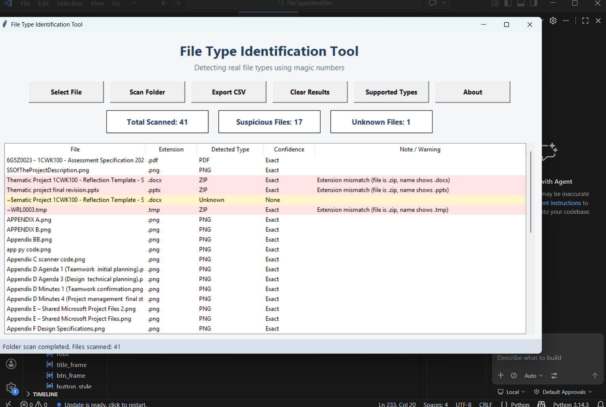

# file-type-identification-tool
A Python-based file type identification tool that detects real file formats using magic numbers and identifies mismatched or suspicious files. Built as a practical cybersecurity-focused application.
# File Type Identification Tool (Magic Number Analysis)

A Python-based application that detects real file formats using binary signature analysis (magic numbers) and identifies mismatched or potentially suspicious files.

---

## 🚀 Project Overview

This tool was developed as part of a personal cybersecurity-focused project to explore how file signature analysis can be used to detect file spoofing and basic evasion techniques.

It scans files or folders, compares their actual binary signatures against known file types, and flags inconsistencies between file extensions and real formats.

---

## ⚙️ Features

- File and folder scanning
- Magic number (file signature) detection
- Mismatch detection (e.g. `.jpg` file that is actually `.exe`)
- Suspicious file flagging
- GUI-based interface
- Export results to CSV

---

## 🧠 Why this matters (Security Context)

Attackers often disguise malicious files using misleading extensions (e.g. `invoice.pdf.exe`).  
This tool demonstrates how low-level file inspection can be used to detect such techniques.

---

## 🖥️ Screenshots

### Main Interface


### Scan Results


---

## 🛠️ Technologies Used

- Python
- Tkinter (GUI)
- JSON (signature database)


---

## ▶️ How to Run

1. Clone the repository:
```bash
git clone https://github.com/amirali-cyber/file-type-identification-tool.git
---

## 📂 Project Structure
